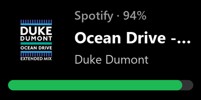
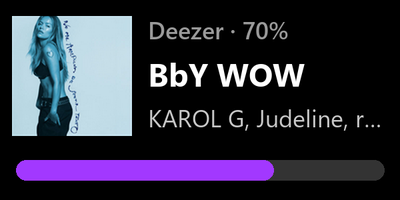
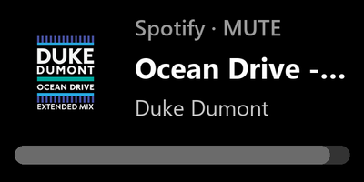

# Music Volume for Stream Deck+

A Stream Deck+ dial that follows whichever music player is open on Windows and controls
that app's volume, not the system volume. Shows title, artist and album art from the
Windows media controls (SMTC).

<p>
  
  
</p>
<p>
  
</p>

Top: following Spotify at 94%, then Deezer at 70%, each with the album art Windows reports
for the track and the player's own accent colour on the bar. Bottom: Spotify muted. Renders
of the touch-strip layout with real data, not photos.

## What it does

- **Rotate** changes the volume of the followed app's audio session.
- **Short press** toggles play/pause. **Hold** toggles mute.
- **Tap the touch strip**: left half previous track, right half next track.

Which player it follows comes from a priority list (default `Spotify,Deezer`). The first
app with an audio session wins, unless a lower one is the one actually playing. Transport
commands go through that app's own SMTC session, so they hit the player the dial shows
rather than whatever Windows considers the current media app.

Volume changes are coalesced: the display updates on every tick, but only one command is
in flight at a time, so a fast spin stays responsive.

## How it works

Per-app volume comes from WASAPI through a long-lived PowerShell helper
(`bin/audio-bridge.ps1`) that walks every active render device, so players routed to a
virtual output (for example Voicemeeter) are found too. Now-playing metadata and transport
commands use `Windows.Media.Control` through a tiny C# shim (`bin/smtc/Smtc.dll`, source
and build script next to it).

## Requirements

- Windows 10 or later
- Stream Deck software 6.5 or later, and a Stream Deck+ (the action is dial-only)
- Windows PowerShell 5.1 (ships with Windows)

## Install

Download the latest `com.z4yross.musicvol.streamDeckPlugin` from the
[releases page](https://github.com/z4yross/streamdeck-music-volume/releases) and
double-click it.

## Settings

| Setting | Default | Meaning |
| --- | --- | --- |
| Players | `Spotify,Deezer` | Process names, comma-separated, in priority order. |
| Step per tick | 3 % | Volume change per dial tick. |
| Refresh | 1 s | How often the dial polls the player, 1 to 10 s. |

## Build from source

```bash
npm install
npm run build          # bundles src/ into com.z4yross.musicvol.sdPlugin/bin
npm run watch          # rebuilds and restarts the plugin on save
npx streamdeck link com.z4yross.musicvol.sdPlugin   # symlink into Stream Deck
npx streamdeck pack com.z4yross.musicvol.sdPlugin   # produce the .streamDeckPlugin
```

To rebuild the SMTC shim after editing `Smtc.cs`, run `bin/smtc/build.cmd` (needs the
Windows SDK union metadata; adjust the path inside if your SDK version differs).

## License

MIT
